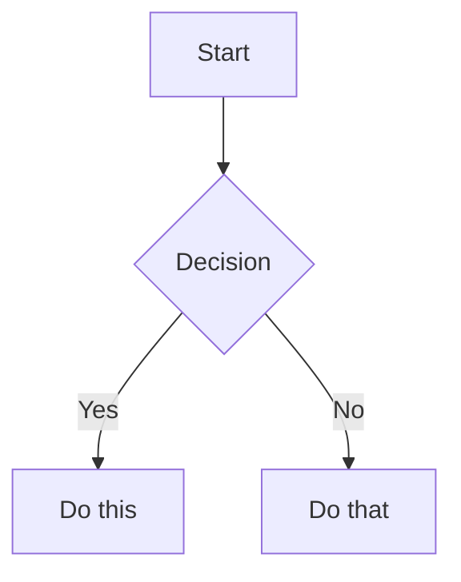
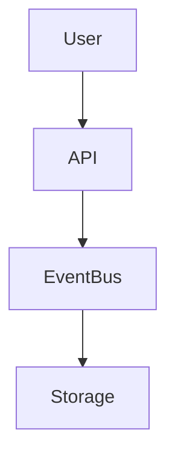

# Obsidian-Specific Syntax Reference

> Catalog of Obsidian Flavored Markdown — the syntax Obsidian *adds on top* of CommonMark + GFM. Standard markdown (headings, bold, lists, tables, code blocks) is assumed knowledge. This file is referenced from `SKILL.md` §11 and complements the convention rules in §1–§9.
>
> **Verification stance**: every snippet here is verified against Obsidian 1.5+ (Live Preview + Reading View). Where parser portability matters (e.g., footnotes), it's flagged.

## How to use this reference

Two different consumption patterns:

1. **At-write time** — look up "how do I link a heading?" / "what's the callout for collapsed FAQ?" — use the table of contents below to jump
2. **At-review time** — feed this file to an LLM together with a draft note to verify all Obsidian-specific syntax renders correctly

The conventions for *when* and *why* to use each syntax (Heading depth, emphasis safety, tag axis policy) live in `SKILL.md`. This file is the *what* — the syntax catalog only.

---

## 1. Wikilinks (internal links)

Obsidian's primary linking mechanism. Resolves against vault file paths and frontmatter `aliases`.

```
[[Note Name]]                   Link to a note by filename or alias
[[Note Name|Display]]           Custom display text (Note Name link, "Display" rendered)
[[Note Name#Heading]]           Link to a specific heading within the note
[[Note Name#Heading#Sub]]       Nested heading (h1 → h2 → h3) — chains with #
[[Note Name#^block-id]]         Link to a specific block (see §2)
[[#Heading in same note]]       Same-note heading link (no note name)
[[#^block-id in same note]]     Same-note block link
```

### Wikilink vs Markdown link — when to use which

- `[[wikilink]]` for notes *inside* the vault. Obsidian auto-updates the link when the note is renamed.
- `[text](url)` for **external URLs** only.
- Avoid `[text](note.md)` for internal links — Obsidian *does* resolve them, but rename-tracking is unreliable, and you lose the alias-resolution that wikilinks get for free.

### Disambiguation

If two notes share the same filename in different folders (e.g., `archive/notes.md` and `current/notes.md`):

```
[[archive/notes]]               Path-disambiguated
[[current/notes]]
```

Obsidian also surfaces a disambiguation popover at type-time.

### Aliases as link targets

A note with frontmatter `aliases: [Old Name, Alternative]` is linkable as `[[Old Name]]` *or* `[[Alternative]]` *or* `[[Actual Filename]]`. All resolve to the same note.

---

## 2. Block IDs

Block-level anchors that let other notes link into a specific paragraph, list item, or quote.

### Defining a block ID

**Paragraph** — append `^id` at the end of the same line:

```
This paragraph can be linked to. ^my-block-id
```

**List item** — append at the end of the bullet line:

```
- An interesting list item. ^list-item-id
```

**Quote block** — place the ID on its **own line** *immediately after* the quote (separated by blank line):

```
> A quote block worth referencing.

^quote-id
```

**Heading-anchored block** — when you want a block link inside a heading section, use `^id` on the paragraph; the link `[[Note#^id]]` will jump to it.

### ID syntax rules

- Allowed characters: letters, digits, hyphens
- Cannot start with a digit
- Case-insensitive at lookup time, but write consistently
- Must be unique *within the note*

### Linking to a block

```
[[Note Name#^my-block-id]]      From another note
[[#^my-block-id]]               From the same note
```

---

## 3. Embeds

Prefix any wikilink with `!` to render the target *inline*.

```
![[Note Name]]                  Full note embed
![[Note Name#Heading]]          Section embed (heading + content)
![[Note Name#^block-id]]        Block embed (single paragraph)
```

### Image embeds

```
![[image.png]]                  Default size
![[image.png|300]]              Width: 300 pixels
![[image.png|300x200]]          Width × Height
```

External image URLs use standard markdown syntax:

```

   Width-syntax on external too (1.5+)
```

### Media embeds

```
![[clip.mp4]]                   Inline video player
![[clip.webm]]
![[song.mp3]]                   Inline audio player
![[song.wav]]
```

### PDF embeds

```
![[document.pdf]]               First page
![[document.pdf#page=3]]        Specific page
![[document.pdf#height=400]]    Specific height
```

### Search / query embeds

Embed a live search result that updates as the vault changes:

````
```query
tag:#project status:active
```
````

The query syntax matches Obsidian's search bar (see Obsidian docs *Search* page).

---

## 4. Callouts

Highlighted boxes inside blockquotes. Format: `> [!type]` for default, `> [!type] Custom Title` for a custom title, `> [!type]-` to collapse, `> [!type]+` to start expanded.

### Built-in types and their aliases

Aliases share the same icon and color — you can write `[!summary]` or `[!tldr]` and get the same `abstract` rendering.

| Canonical type | Aliases | Common use |
|---|---|---|
| `note` | — | General note |
| `abstract` | `summary`, `tldr` | Summary / TL;DR |
| `info` | — | Informational context |
| `todo` | — | Task to do |
| `tip` | `hint`, `important` | Helpful tip |
| `success` | `check`, `done` | Completed / verified |
| `question` | `help`, `faq` | Question / FAQ |
| `warning` | `caution`, `attention` | Caution required |
| `failure` | `fail`, `missing` | Failed / missing |
| `danger` | `error` | Critical error |
| `bug` | — | Known bug |
| `example` | — | Worked example |
| `quote` | `cite` | Quoted material |

### Syntax variations

```
> [!note]
> Default callout. Title is "Note" (auto-generated).

> [!warning] Custom Title Here
> Override the auto-title.

> [!faq]- Collapsed by default
> Click to expand. Use `-` after the type.

> [!success]+ Expanded by default
> Use `+` after the type. Click to collapse.
```

### Nesting

Callouts can nest by adding `>` levels:

```
> [!info] Outer callout
> Outer content.
>
> > [!warning] Inner callout
> > Inner content. The blank line `>` between outer content and inner block is required.
```

### Custom callouts via CSS

```
> [!my-custom-type]
> Type any name; if no CSS class matches, falls back to `note` styling.
```

Combine with a CSS snippet (Settings → Appearance → CSS snippets) to style `my-custom-type` distinctly.

---

## 5. Properties (Frontmatter)

YAML at the top of the file. Obsidian 1.4+ added typed properties — Obsidian assigns each property a type based on its values.

```yaml
---
title: Project Alpha
date: 2026-06-05
tags:
  - project
  - active
aliases:
  - Alt Name
  - Another Name
cssclasses:
  - custom-class
status: in-progress
priority: 3
reviewed: false
---
```

### Property types (Obsidian 1.4+)

| Type | YAML pattern | Notes |
|---|---|---|
| **Text** | `title: hello` | Default if value is a quoted/unquoted string |
| **List** | `tags:\n  - a\n  - b` | YAML list; also `tags: [a, b]` inline |
| **Number** | `priority: 3` | Bare numeric |
| **Checkbox** | `reviewed: false` | Bare `true` / `false` |
| **Date** | `date: 2026-06-05` | ISO 8601 date |
| **Datetime** | `created: 2026-06-05T14:30:00` | ISO 8601 with time |

Obsidian's Properties panel will surface these as typed inputs. To force a type, declare it in Settings → Files & Links → Property types.

### Standard property names

| Property | Effect |
|---|---|
| `tags` | Adds to vault tag index, searchable as `#tagname` |
| `aliases` | Alternative names for wikilink resolution |
| `cssclasses` | CSS classes applied to the note body, enables custom styling |
| `publish` | Used by Obsidian Publish to mark which notes are published |
| `cover` | Cover image (used by some themes) |

### Tag list syntax in frontmatter

```yaml
# All three forms work:
tags: [project, active]
tags: project active
tags:
  - project
  - active
```

The YAML-list form (one per line) is most editor-friendly for diff readability.

---

## 6. Tags

```
#tag                            Inline tag
#nested/tag                     Hierarchical tag
#한국어-태그                    Korean / Unicode tags work
#日本語タグ                     Japanese works
```

### Tag character rules

- **First character**: must be a letter (any script) — not a digit
- **Allowed characters**: letters, digits (not first), `_`, `-`, `/`
- **Forbidden**: spaces, periods, parentheses, brackets, `@`, `#`, `&`, `*`
- **Case-insensitive at search**, but write consistently
- Maximum length: practical limit ~50 chars; no hard limit

### Inline vs frontmatter tags

| Form | Where | Notes |
|---|---|---|
| `#tag` in body | Anywhere in prose | Visible inline; searchable. Use sparingly — most tags belong in frontmatter |
| `tags:` in frontmatter | YAML | Cleaner — doesn't clutter prose. **Don't prefix with `#`** in YAML |

```yaml
---
tags:
  - project     # ✅ no # prefix in YAML
  - active
---
```

Inline tags inside code blocks and comments are *not* counted by the vault index. Useful for examples.

---

## 7. Comments

Text inside `%%...%%` is hidden in Reading View (and in Live Preview when the cursor isn't on the line).

```
This text is visible %%but this part is hidden%%.

%%
This whole block is hidden.
Useful for editor-only notes, TODOs, draft thinking.
%%
```

Use cases:
- Editor-only TODOs you don't want in the published note
- Notes-to-future-self that shouldn't appear in the rendered output
- Hiding draft sections while you decide whether to keep them

**Not portable**: `%%comment%%` is Obsidian-specific. Pandoc / GitHub / cmark renders the literal `%%`. Use HTML comments `<!-- ... -->` for portability — they're hidden in *all* markdown renderers.

---

## 8. Highlight

```
==highlighted text==
```

Renders with a yellow background. Compatible with GFM and other parsers that support it; otherwise renders as literal `==`.

### ⚠ Same flanking rule as `**bold**`

The `==highlight==` delimiter follows CommonMark flanking rules — *just like* `**` and `*`. The same Korean-particle breakage patterns apply:

```
❌ ==강조 텍스트==이다       ← Korean particle after closing == → breaks
✅ ==강조 텍스트== 이다       ← whitespace after closing
✅ "==강조 텍스트==이다"     ← surrounding punct shifts the rule
```

Run `SKILL.md §10` Stage 1 grep with `=` substituted for `*` to catch highlight-breakage in CJK notes:

```bash
grep -nP '[\)\]"'\''\.,:;!?\$…—–。、」』]==[\p{Hangul}\p{Hiragana}\p{Katakana}\p{Han}]' *.md
grep -nP '[\p{Hangul}\p{Hiragana}\p{Katakana}\p{Han}]==["\(\[\$「『]' *.md
```

---

## 9. Math (LaTeX / MathJax)

Obsidian uses MathJax 3.x.

### Inline math

```
The Euler identity is $e^{i\pi} + 1 = 0$.
```

Note the `$` directly against text — generally fine because `$ ... $` is parsed as a single math span. The `$` is *not* subject to flanking like `**` (it has its own delimiter logic).

### Display math (block)

```
$$
\frac{a}{b} = c
$$
```

Block math must be on its own line(s) — opening `$$` and closing `$$` each on their own line, or compact form `$$ ... $$` on one line.

### Common environments inside `$$...$$`

```
$$
\begin{align}
y &= mx + b \\
y &= 2x + 3
\end{align}
$$
```

The `\\` is a line break in MathJax (not markdown). `align` requires the `amsmath` package, which MathJax loads by default.

### Math + emphasis combination

When math is adjacent to `**bold**` or `==highlight==`, the `$` counts as punctuation for flanking → emphasis breakage. See SKILL.md §6 Pattern 5 + ref/emphasis-breakage-deep-dive.md §3 Pattern 5.

---

## 10. Mermaid diagrams

````

````

### Linking nodes to vault notes

```
class NodeName internal-link;
```

Add this line *inside* the mermaid block to make `NodeName` clickable into a vault note named `NodeName`. Compatible with `graph`, `flowchart`, and `classDiagram`. Some chart types (e.g., `sequenceDiagram` actors) may not honor it.

⚠ This `internal-link` class is **Obsidian-injected** — won't work on github.com or other Mermaid renderers. The diagram still renders; the link just doesn't navigate.

### Supported diagram types (Obsidian 1.5+ uses Mermaid 10.x)

`graph` / `flowchart` / `sequenceDiagram` / `classDiagram` / `stateDiagram` / `erDiagram` / `gantt` / `pie` / `journey` / `gitGraph` / `mindmap` / `timeline` / `xychart-beta` / `sankey-beta`.

---

## 11. Footnotes

### Standard form (GFM-compatible)

```
Text with a footnote reference[^1].

[^1]: Footnote content. Can span
    multiple lines if indented.
```

Reference and definition can appear *anywhere* in the document — Obsidian groups them at the bottom.

### Inline footnotes

```
Text with an inline footnote.^[This is the content directly inline.]
```

⚠ **Portability warning**: Inline `^[...]` works in Obsidian and Pandoc but **not** in standard CommonMark, GFM, or most cmark-based renderers (GitHub, GitLab). If your notes might leave Obsidian, prefer the standard form.

### Multiple references to same footnote

```
First reference[^1]. Later, another reference[^1] to the same note.

[^1]: This footnote is referenced twice.
```

---

## 12. Task lists (checkboxes)

Standard GFM:

```
- [ ] Empty
- [x] Done
```

### Obsidian extensions

Obsidian recognizes additional state markers (with default CSS — themes may visualize differently):

```
- [/] In progress
- [-] Cancelled
- [?] Question / uncertain
- [!] Important
- [*] Starred
- [<] Scheduled
- [>] Forwarded / rescheduled
- ["] Quote
- [b] Bookmark
- [I] Info
- [S] Idea
- [p] Pro
- [c] Con
```

Not all themes style every state distinctly — many fall back to the empty `[ ]` look but still parse the marker correctly for search.

### Tasks plugin extensions

The community plugin **Tasks** adds further syntax for due dates, recurrence, priority:

```
- [ ] Task description 🗓 2026-06-10 🔁 every week ⏫
```

Emoji-encoded metadata: `🗓` due date, `⏳` scheduled, `🛫` start, `🔁` recurrence, `⏫` high priority, `🔼` medium, `🔽` low.

---

## 13. Strikethrough

```
~~deleted text~~
```

Standard GFM. Works in Obsidian and most other renderers. Use for marking deprecated decisions (see `SKILL.md` §1.4 — preserve struck-through text rather than deleting).

---

## 14. HTML embedding

Obsidian supports a subset of inline HTML:

```html
<span style="color: red;">Red text</span>
<details><summary>Click to expand</summary>Hidden content.</details>
<sub>subscript</sub> and <sup>superscript</sup>
<kbd>Ctrl</kbd>+<kbd>C</kbd>
```

`<iframe>` is restricted by default for security — local file iframes are blocked. External iframes work in some contexts (see `obsidian-data-viz` SKILL.md §⑥ Trap 1 for the iframe story when porting external HTML).

---

## 15. Properties + dataview integration

When the Dataview community plugin is installed, frontmatter properties become queryable:

````
```dataview
TABLE rating, status, date
FROM "Reviews"
WHERE rating >= 8
SORT date DESC
```
````

This is *not* Obsidian-core syntax — Dataview is a community plugin. But it's the most common reason for thoughtful property naming, so worth noting.

For interactive visualizations driven by Dataview JS, see the companion skill `obsidian-data-viz`.

---

## 16. Putting it together — a complete annotated example

````markdown
---
title: Project Alpha
sticker: emoji//1f680
date: 2026-06-05
tags:
  - project
  - active
aliases:
  - Alpha Initiative
cssclasses:
  - dense-layout
status: in-progress
priority: 3
reviewed: false
---

> **Scope**: greenfield project, Q3 2026 ship target.

## What this project is

We're building a [[workflow improvement tool]] for personal productivity.
The architecture follows ==event-driven design== — see [[Architecture#Event Flow]]
for the diagram.

> [!important] Key Deadline
> First milestone is due on **2026-09-30**. See [[Schedule#Milestones]].

> [!tip]- Implementation hint (click to expand)
> Use the existing [[utility/event-bus]] module — extending it is cheaper than rebuilding.

## Tasks

- [x] Initial planning
- [/] Backend implementation
    - [x] Schema design
    - [ ] API endpoints
    - [?] Caching strategy — TBD with team
- [ ] Frontend
- [-] Marketing site — scope cut

## Architecture

The algorithm uses $O(n \log n)$ sorting; for details see [[Algorithm Notes#Sorting]].



![[Architecture Diagram.png|600]]

## References

- Original RFC discussion ^rfc-decision
- Reviewed in [[Meeting Notes 2026-06-01#Decisions]]
- See footnote on consistency[^1]

[^1]: The eventual-consistency trade-off was negotiated with the team; see [[Consistency Decisions]] for the full discussion.

%%
Editor-only: remember to ping the security team before sprint 2.
%%
````

This single example exercises: typed properties (5 types), aliases, cssclasses, sticker, wikilinks (4 variations including same-note heading), embeds (image with width), callouts (2 types including collapsible), task lists (5 states), inline math, mermaid with internal-link, block ID, footnote, hidden comment, highlight, strikethrough. Every Obsidian-specific syntax from §1–§14 except external HTML and query embed.

---

## What this reference is *not*

- **Not a tutorial** — assumes you can read markdown
- **Not a convention enforcer** — the *when and why* lives in `SKILL.md`. This file is the *what*
- **Not exhaustive on plugins** — only mentions Dataview and Tasks where relevant to core syntax decisions. The community plugin ecosystem is vast (Excalidraw, Kanban, Templater, etc.) and out of scope here

For the canonical Obsidian documentation, see <https://help.obsidian.md/Editing+and+formatting>. This reference distills the subset most relevant when writing under this skill's conventions.
